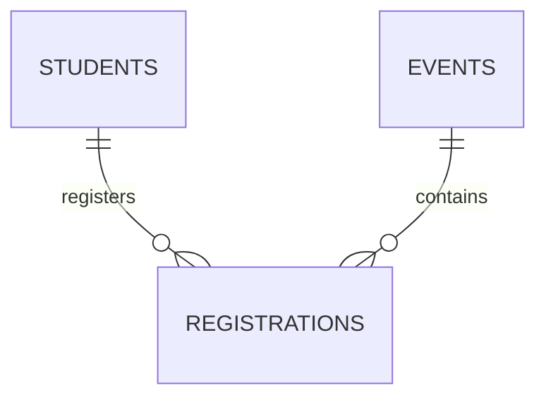

# Campus Event Pass Manager API

**Midterm submission — From Prototype to Production**  
Contract-first **OpenAPI 3.1** REST API (TypeScript, Express, **openapi-backend**), **Supabase (PostgreSQL)** persistence, **@hey-api/openapi-ts** generated SDK, minimal **Vite** client, deployed on **Azure App Service** + **Vercel**.

---

## Submission package

**Author:** Yogesh Kadam — ykadam1@hawk.illinoistech.edu  


| Deliverable | Link |
|-------------|------|
| **GitHub repository** | https://github.com/Ykadam006/Student-Event-Pass-Manager-API |
| **Live API — Swagger UI (`/docs`)** | https://student-event-pass-manager-api-gxetbzfvfefdakeb.eastus-01.azurewebsites.net/docs |
| **Live API — base URL** | https://student-event-pass-manager-api-gxetbzfvfefdakeb.eastus-01.azurewebsites.net |
| **OpenAPI YAML** | https://student-event-pass-manager-api-gxetbzfvfefdakeb.eastus-01.azurewebsites.net/openapi.yaml |
| **OpenAPI JSON** | https://student-event-pass-manager-api-gxetbzfvfefdakeb.eastus-01.azurewebsites.net/openapi.json |
| **Live client (static site)** | https://student-event-pass-manager-api.vercel.app/ |


**Client generator (course requirement):** [**@hey-api/openapi-ts**](https://github.com/hey-api/openapi-ts) with [**@hey-api/client-fetch**](https://heyapi.dev). Regenerate with:

```bash
npm run generate:client
```

Output directory: **`generated-client/`** (committed; do not edit by hand).

---

## What this project delivers

- **Part 1 — Database:** In-memory store replaced by **cloud PostgreSQL** (Supabase). All six `operationId` handlers read/write via **`src/store/eventPasses.ts`**. Seed data in **`supabase/schema.sql`**.
- **Part 2 — Generated client:** Typed SDK in **`generated-client/`** from **`openapi.yaml`**. The **`client/`** app calls **`eventPassServiceList`**, **`eventPassServiceCreate`**, **`eventPassServiceDelete`**, **`eventPassServiceCapacityInsights`** only — no raw `fetch` for those routes.
- **Part 3 — Deployment:** API on **Azure** (Node 24, Linux) with env vars **`SUPABASE_URL`** and **`SUPABASE_SERVICE_ROLE_KEY`**. Client on **Vercel** (`client/dist`). **`openapi.yaml` `servers`** lists the deployed Azure URL first (default SDK base URL).

---

## Why this domain

Campus events (hackathons, workshops, career fairs) need consistent **capacity** and **registration** tracking. The API supports full CRUD plus a **custom analytics** endpoint (`GET /capacity-insights`).

---

## Tech stack

| Tool | Role |
|------|------|
| TypeScript | Implementation |
| Express | HTTP server |
| openapi-backend | Spec-driven routing; **`validate: true`** + Ajv / **ajv-formats** |
| swagger-ui-express | **`/docs`** |
| yamljs | **`/openapi.json`** from YAML |
| Supabase + `@supabase/supabase-js` | PostgreSQL; **service role** on server only |
| dotenv | Local **`SUPABASE_*`** from `.env` |
| **@hey-api/openapi-ts** | SDK in **`generated-client/`** |
| tsx + nodemon | **`npm run dev`** |
| Vite | **`client/`** build |

---

## Project structure

```
student-event-pass-manager-api/
├── openapi.yaml                 # Contract (single source of truth)
├── generated-client/            # npm run generate:client — do not hand-edit
├── client/                      # Vite SPA (SDK only)
├── supabase/schema.sql          # DDL + seed (run in Supabase SQL Editor)
├── .env.example                 # Required env var names (no secrets)
└── src/
    ├── server.ts
    ├── lib/supabase.ts
    ├── types/eventPass.ts
    ├── store/eventPasses.ts     # Only data layer that changed vs Assignment 1
    └── handlers/                # One file per operationId
```

---

## API endpoints

| Method | Path | operationId | Description |
|--------|------|-------------|-------------|
| GET | `/` | `EventPassService_list` | List all passes |
| POST | `/` | `EventPassService_create` | Create pass |
| GET | `/{id}` | `EventPassService_get` | Get by id |
| PATCH | `/{id}` | `EventPassService_update` | Partial update |
| DELETE | `/{id}` | `EventPassService_delete` | Delete |
| GET | `/capacity-insights` | `EventPassService_capacityInsights` | Capacity analytics |
| GET | `/{id}/tracking` | `EventPassService_tracking` | Third-party logistics tracking (mock) |
| GET | `/students/{studentId}/recommendations` | `StudentService_recommendations` | Third-party recommendations (mock) |
| GET | `/docs` | — | Swagger UI |
| GET | `/openapi.yaml` | — | Spec (YAML) |
| GET | `/openapi.json` | — | Spec (JSON) |

### Handler files ↔ generated SDK

| operationId | Handler | SDK function |
|-------------|---------|--------------|
| `EventPassService_list` | `EventPassService_list.ts` | `eventPassServiceList` |
| `EventPassService_create` | `EventPassService_create.ts` | `eventPassServiceCreate` |
| `EventPassService_get` | `EventPassService_get.ts` | `eventPassServiceGet` |
| `EventPassService_update` | `EventPassService_update.ts` | `eventPassServiceUpdate` |
| `EventPassService_delete` | `EventPassService_delete.ts` | `eventPassServiceDelete` |
| `EventPassService_capacityInsights` | `EventPassService_capacityInsights.ts` | `eventPassServiceCapacityInsights` |
| `EventPassService_tracking` | `EventPassService_tracking.ts` | (after regenerate client) |
| `StudentService_recommendations` | `StudentService_recommendations.ts` | (after regenerate client) |

---

## Database (Supabase)

1. [Supabase dashboard](https://supabase.com/dashboard) → **SQL Editor** → run **`supabase/schema.sql`** (idempotent).
2. **Project Settings → API:** copy **URL** and **service_role** key for the server only.
3. For final rubric evidence (3 related tables + indexes), run **`supabase/schema_v2.sql`**.

### Table `public.event_passes`

| Column | Type | API field |
|--------|------|-----------|
| `id` | `text` PK | `id` |
| `event_name` | `text` | `eventName` |
| `category` | `text` | `category` (Workshop, Hackathon, Seminar, Networking, CareerFair) |
| `venue` | `text` | `venue` |
| `event_date` | `date` | `eventDate` |
| `capacity` | `integer` (> 0) | `capacity` |
| `registered_count` | `integer` (≥ 0) | `registeredCount` |
| `pass_type` | `text` | `passType` (Free, Standard, VIP) |

---

## Local setup

```bash
git clone https://github.com/Ykadam006/Student-Event-Pass-Manager-API.git
cd Student-Event-Pass-Manager-API
npm install
cp .env.example .env
# Set SUPABASE_URL and SUPABASE_SERVICE_ROLE_KEY in .env
```

### Run API

```bash
npm run dev
```

- API: http://localhost:3000  
- Swagger: http://localhost:3000/docs  

### Run browser client

```bash
npm run client:dev
```

- Client: http://localhost:5173  

To call **local** API from the client, copy **`client/.env.example`** → **`client/.env`** and set:

```bash
VITE_API_BASE_URL=http://localhost:3000
```

Otherwise the SDK uses the **first** URL in **`openapi.yaml` `servers`** (production Azure).

### Static client build (same as Vercel)

```bash
npm install
npm run generate:client
npm run client:build
```

Artifacts: **`client/dist/`**. Example host build command:  
`npm install && npm run generate:client && npm run client:build`

The API sends **CORS** headers (including reflected `Origin` for browsers like localhost:5173). Redeploy the API after CORS or handler changes.

---

## Production build (local)

```bash
npm run build
npm start
```

---

## Azure deployment

- **Runtime:** Linux, Node **24.x** (`package.json` `engines`).  
- **Deploy:** GitHub → App Service **Deployment Center**; build **`npm install && npm run build`**, start **`npm start`**.  
- **Required settings:** `SUPABASE_URL`, `SUPABASE_SERVICE_ROLE_KEY`. Missing values → **500** on data routes.

### Troubleshooting

- **`GET /` returns 500:** Almost always wrong or missing Supabase env vars in Azure; check **Log stream** and fix **Application settings**.  
- **`ReferenceError: cors is not defined`:** Use current **`server.ts`** (manual CORS only; no `cors()` middleware).  
- **Port 3000 in use locally:** `lsof -i :3000` → kill PID, or `PORT=3001 npm run dev`.

---


## Reflection

I chose this domain because it is practical for a university setting and supports both CRUD and a meaningful **capacity insights** endpoint. TypeScript, Express, and openapi-backend matched the course workflow and made contract-first development concrete.

The main lesson is **order of work**: design **OpenAPI** first, then implement handlers against that contract. The spec became the blueprint for validation, Swagger, and the generated client. Keeping **schemas**, **handlers**, and **types** aligned took discipline; registering **`/docs`**, **`/openapi.yaml`**, and **`/openapi.json`** before the openapi-backend catch-all was essential. **`validate: true`** catches bad bodies and enums before business logic.

Compared with code-first APIs, contract-first feels more disciplined: more upfront design, but a single source of truth that reduces drift between documentation, server, and client.

---

## GraphQL integration (advanced backend capability)

This project now supports both transports on the same backend:

- REST (OpenAPI): existing endpoints remain unchanged
- GraphQL: `POST /graphql`
- Shared service layer: REST handlers and GraphQL resolvers both call `src/services/*`

### GraphQL features implemented

- Types, queries, mutations, enums, and input types
- Filtering and pagination (`events(filter, pagination)`)
- Relationships (`Event.registrations`, `Registration.student`, `Registration.event`)
- Calculated fields (`Event.availableSeats`, `Event.status`)
- Error handling with clear GraphQL errors for invalid IDs and bad input

### GraphQL schema and examples

- Schema: `src/graphql/schema.ts`
- Resolvers: `src/graphql/resolvers.ts`
- Relational schema (3-table model): `supabase/schema_v2.sql`

### Testing

Run:

```bash
npm test
```

Test files:

- `src/tests/rest.test.ts`
- `src/tests/graphql.test.ts`

---

## Architecture

- REST handlers (`src/handlers`) and GraphQL resolvers (`src/graphql/resolvers.ts`) both call the same service layer (`src/services`).
- Service layer wraps validation, business rules, and data access.
- Event data persists in Supabase via `src/store/eventPasses.ts`.
- GraphQL student/registration relationship data is in `src/data`, and registration mutations update event counts through `event.service`.

### Layering

1. Transport layer: OpenAPI routes + `/graphql`
2. Application layer: services (`event`, `registration`, `student`, `insight`, `tracking`, `recommendation`)
3. Data layer: Supabase store + in-memory relationship data for GraphQL joins

## GraphQL examples

Endpoint: `POST /graphql`

```graphql
query GetEvents {
  events {
    id
    title
    location
    eventDate
    capacity
    registeredCount
    availableSeats
    status
  }
}
```

```graphql
query FilterEvents {
  events(filter: { status: UPCOMING, search: "backend" }, pagination: { limit: 5, offset: 0 }) {
    id
    title
    location
    availableSeats
    status
  }
}
```

```graphql
query CapacityInsights {
  capacityInsights {
    totalEvents
    totalCapacity
    totalRegistered
    totalAvailableSeats
    averageFillRate
    fullEvents
  }
}
```

```graphql
mutation CreateEvent {
  createEvent(input: { title: "Backend API Workshop", location: "Illinois Tech", eventDate: "2026-05-10", capacity: 50 }) {
    id
    title
    capacity
    availableSeats
    status
  }
}
```

## Phase-2 integrations

- `GET /{id}/tracking` via `EventPassService_tracking` and `src/services/tracking.service.ts` (`MockShip API`).
- `GET /students/{studentId}/recommendations` via `StudentService_recommendations` and `src/services/recommendation.service.ts` (`Mock Recommendation API`).
- Invalid IDs return 404 with explicit messages.

## Database ERD (3-table model)



Full SQL: `supabase/schema_v2.sql`

## REST vs GraphQL comparison

REST uses multiple resource endpoints (`/`, `/{id}`, `/capacity-insights`), while GraphQL uses one endpoint (`/graphql`) and lets clients request only required fields. In this project, REST fits contract-first operations and Swagger tooling; GraphQL fits flexible field selection, nested relationships, and filter/pagination in one query.

## Final demo script (3-5 minutes)

1. Show repository structure and layered architecture.
2. Open `/docs` and run core REST endpoints.
3. Run integration endpoints (`/{id}/tracking`, `/students/{studentId}/recommendations`).
4. Run GraphQL queries/mutations (`events`, `create/update/delete`, `capacityInsights`).
5. Show `npm test` output.
6. Show deployed links and close with REST vs GraphQL comparison.

## Final report notes

### Design decisions
- Kept contract-first REST as source of truth (OpenAPI).
- Added GraphQL alongside REST (not replacement).
- Reused common service layer for REST and GraphQL.

### Challenges and solutions
- Kept REST stable during GraphQL integration by introducing `src/app.ts` composition root.
- Added deterministic `NODE_ENV=test` store behavior for test isolation.
- Centralized validation/business rules in services to avoid duplicated logic.

### Security and future improvements
- OpenAPI validation enabled, explicit CORS, env-based secrets.
- Future scope: auth (JWT), DataLoader, cursor pagination, real provider integrations, richer monitoring.

## Submission checklist

- [x] GitHub repository link
- [x] Live deployed API URL
- [x] Swagger/OpenAPI docs URL
- [x] GraphQL endpoint (`/graphql`)
- [x] REST + GraphQL source code
- [x] GraphQL schema + examples
- [x] Architecture + performance comparison in this README
- [x] Automated test files
- [ ] Test result screenshots
- [ ] REST/GraphQL success screenshots
- [ ] Exported Postman collection
