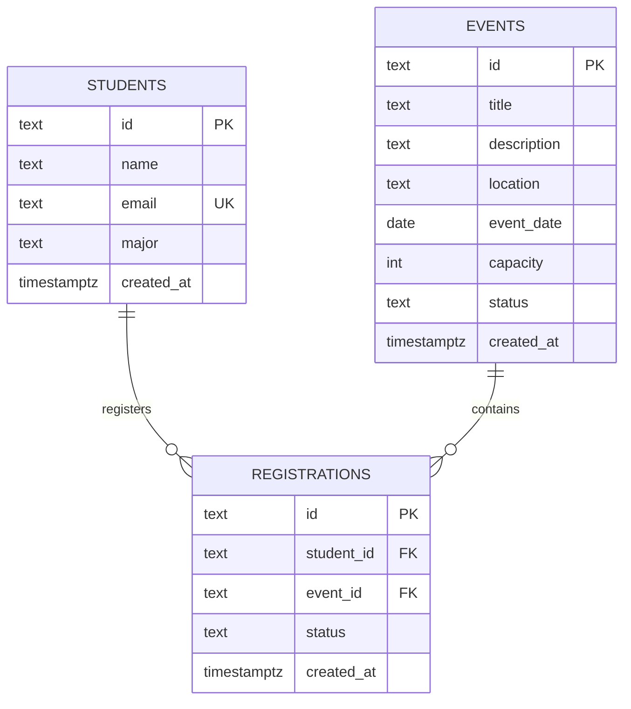

# Database Schema Diagram (ERD)

```mermaid
erDiagram
  STUDENTS ||--o{ REGISTRATIONS : registers
  EVENTS ||--o{ REGISTRATIONS : contains

  STUDENTS {
    text id PK
    text name
    text email UK
    text major
    timestamptz created_at
  }

  EVENTS {
    text id PK
    text title
    text description
    text location
    date event_date
    int capacity
    text status
    timestamptz created_at
  }

  REGISTRATIONS {
    text id PK
    text student_id FK
    text event_id FK
    text status
    timestamptz created_at
  }
```

SQL implementation: `supabase/schema_v2.sql`
